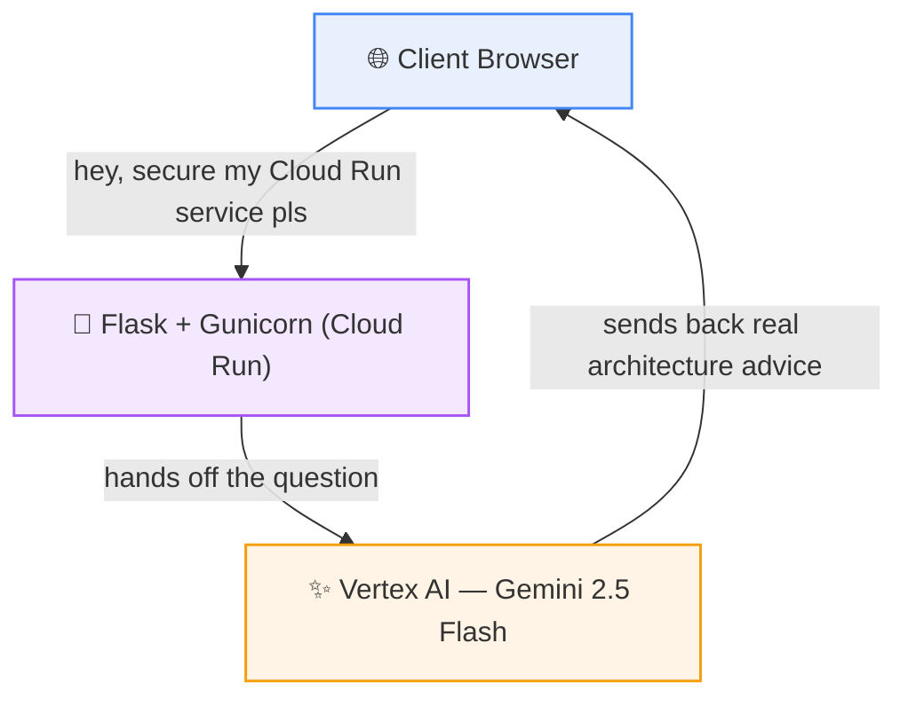
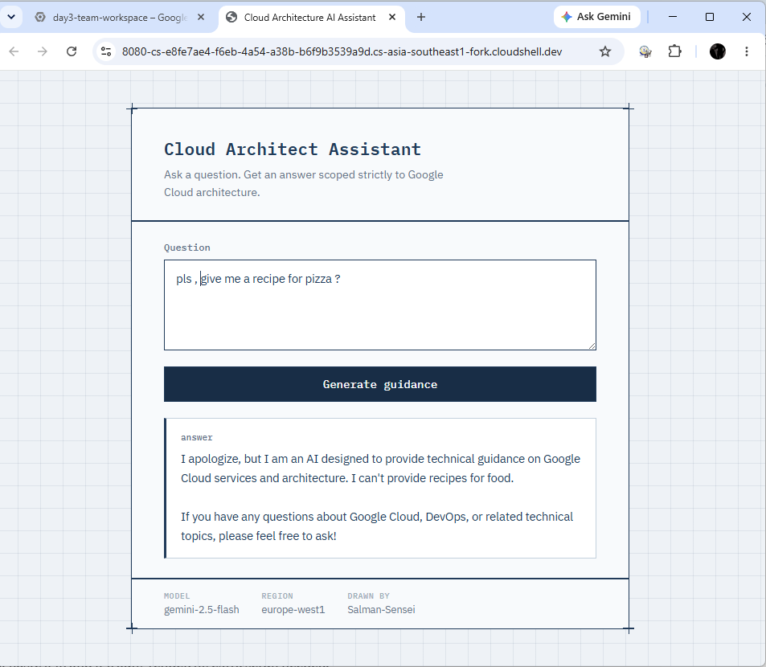
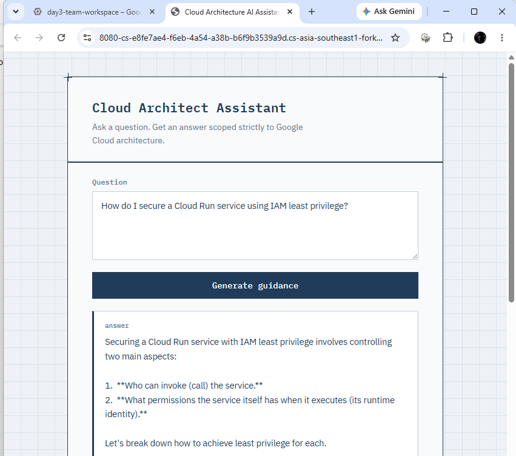
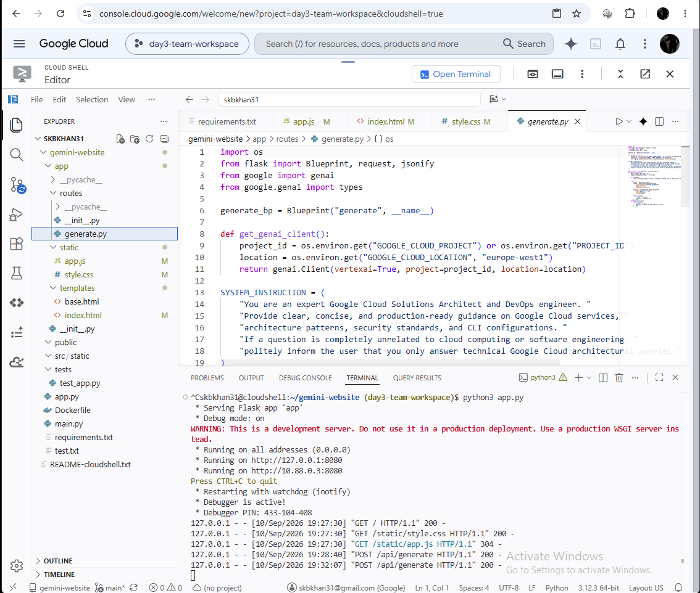

<div align="center">


<br/>


</div>

---

## What is this?

A Flask app with one job: turn Gemini 2.5 Flash into a no-nonsense Google Cloud Solutions Architect that lives in your browser. Ask it about IAM, Cloud Run, VPCs, whatever — it'll give you real, production-ready guidance. Ask it something *unrelated*, and it'll politely (but firmly) redirect you back to cloud topics. It has boundaries. Respect them.

<!-- 🎬 Drop your own pick here — grab any gif link from https://giphy.com and paste it in:
<div align="center"></div>
-->

## Architecture



**In plain English:** you ask a question → Flask catches it → Gemini thinks about it like a Cloud Architect → the answer flows right back to your browser. No middlemen, no nonsense.

## See it in action

### ✅ Ask it something real, get something useful


### 🍕 Try to derail it, watch it stay professional


### 🛠️ Behind the scenes — built live in Cloud Shell


---

## Tech Stack

| Layer | Tech |
|---|---|
| Backend | Flask, Gunicorn |
| AI | Gemini 2.5 Flash via Vertex AI (`google-genai` SDK) |
| Frontend | HTML, CSS, vanilla JS — no framework bloat |
| Deployment | Docker → Artifact Registry → Cloud Run |
| Testing | pytest |

## Configuration

<pre>
Runtime SA : gemini-app-runner@&lt;PROJECT_ID&gt;.iam.gserviceaccount.com
Role       : roles/aiplatform.user
Model      : gemini-2.5-flash
Region     : europe-west1
</pre>


## Run it yourself

```bash
pip install -r requirements.txt
export GOOGLE_CLOUD_PROJECT=<your-project-id>
export GOOGLE_CLOUD_LOCATION=europe-west1
python3 app.py
```

Then hit `http://localhost:8080` and start interrogating it about cloud architecture.

## Run the tests

```bash
python3 -m pytest tests/test_app.py -v
```

All green, every time. 🟢

---

<div align="center">


</div>
